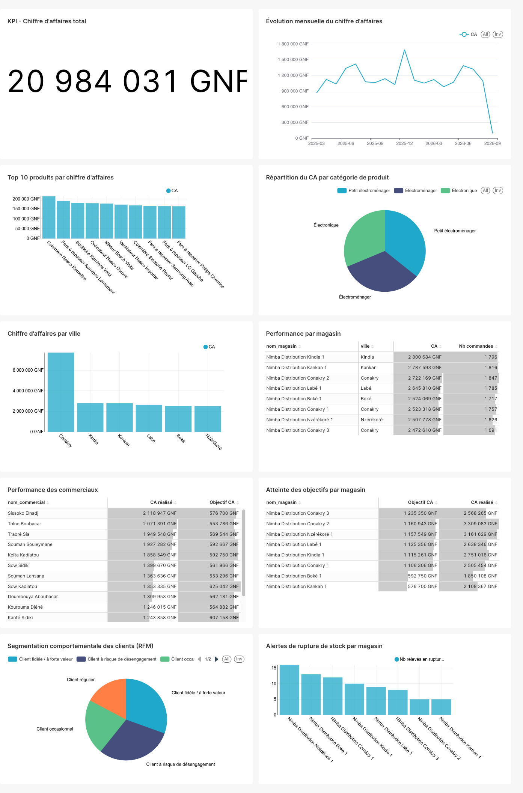

# Nimba Distribution — Système d'Information Décisionnel

Système d'Information Décisionnel complet, reposant sur un Data Warehouse PostgreSQL, pour une entreprise fictive de distribution (**Nimba Distribution**, réseau de 8 magasins/agences en Guinée).

> Documentation complète : [`docs/RAPPORT_SYNTHESE.md`](docs/RAPPORT_SYNTHESE.md) (contexte et choix), [`docs/ARCHITECTURE.md`](docs/ARCHITECTURE.md) (schéma d'architecture) et [`docs/MODELE_DIMENSIONNEL.md`](docs/MODELE_DIMENSIONNEL.md) (modèle en étoile détaillé).

## Aperçu du tableau de bord



## Stack technique

| Brique | Technologie |
|---|---|
| SGBD / Data Warehouse | PostgreSQL 16 |
| ETL | Python 3.11 + pandas + SQLAlchemy |
| Orchestration | Apache Airflow 2.10 |
| Visualisation | Apache Superset 4.1 |
| Déploiement | Docker Compose |

## Structure du dépôt

```
sid-nimba-distribution/
├── docker-compose.yml          # Orchestration de l'ensemble de la stack
├── docker/                     # Dockerfiles et configuration par service
│   ├── airflow/                #   image Airflow (+ dépendances etl/)
│   ├── etl/                    #   image légère pour commandes ETL ponctuelles
│   ├── postgres/init/          #   scripts d'initialisation des bases (1er démarrage)
│   └── superset/                #   image Superset (+ config applicative)
├── sql/                         # Scripts SQL, exécutés dans l'ordre des dossiers
│   ├── 01_source_erp/           #   schéma de la base opérationnelle (OLTP)
│   ├── 02_staging/               #   zone de staging du DWH
│   ├── 03_dwh/                    #   modèle en étoile (dimensions + faits) + seeds
│   └── 04_views/                   #   vues de restitution (schéma mart, 1/indicateur)
├── etl/                          # Pipeline ETL (package Python)
│   ├── extract/                  #   1 module par source (CSV, Excel, JSON, ERP)
│   ├── load/                      #   chargement dimensions (SCD1/2) + faits
│   ├── utils/                      #   connexions DB, logging, contrôles qualité
│   ├── dags/                        #   DAG Airflow (orchestration du pipeline)
│   ├── tests/                        #   tests unitaires (pytest)
│   └── run_pipeline.py                #   orchestrateur (exécutable en local ou par Airflow)
├── dashboard/
│   ├── provision_dashboard.py       # Provisionnement automatique via l'API Superset
│   └── assets/                       # Export statique du dashboard (référence/sauvegarde)
├── data/
│   ├── scripts/generate_sample_data.py  # Générateur du jeu de données d'exemple
│   ├── raw/{csv,excel,json}/            # Fichiers sources générés (gitignorés, régénérables)
│   └── samples/                          # Aperçu figé de chaque source (versionné)
├── docs/                                # Rapport, architecture, modèle dimensionnel
├── requirements.txt                      # Dépendances Python (etl/, data/scripts/)
├── requirements-airflow.txt                # Dépendances additionnelles image Airflow
└── .env.example                             # Variables d'environnement (à copier en .env)
```

## Démarrage rapide (Docker Compose)

Prérequis : Docker et Docker Compose installés, accès réseau normal aux registres d'images (voir note ci-dessous si vous exécutez ceci dans un environnement à accès réseau restreint).

```bash
# 1. Cloner le dépôt puis se placer à sa racine
git clone <url-du-depot> && cd sid-nimba-distribution

# 2. Copier le fichier d'environnement
cp .env.example .env
# (facultatif : ajuster les identifiants/mots de passe pour un usage non-démo)

# 3. Démarrer toute la stack (build des images + PostgreSQL + Airflow + Superset)
docker compose up -d --build

# 4. Générer le jeu de données d'exemple et alimenter la base ERP source
docker compose run --rm etl-tools python3 data/scripts/generate_sample_data.py

# 5. Exécuter le pipeline ETL une première fois (sinon, il tournera automatiquement
#    via le DAG Airflow planifié tous les jours à 03h00, ou déclenchable manuellement
#    depuis l'interface Airflow)
docker compose run --rm etl-tools python3 -m etl.run_pipeline --step all
```

Accès aux interfaces :
- **Airflow** : http://localhost:8080 (identifiants définis dans `.env`, `admin`/`admin` par défaut)
- **Superset** : http://localhost:8088 (identifiants définis dans `.env`, `admin`/`admin` par défaut)

Le service `superset-provision` crée automatiquement, au premier démarrage, la connexion à la base `dwh`, les 7 datasets et les 10 graphiques du tableau de bord **"Nimba Distribution - Pilotage commercial"** (rejouable sans créer de doublons). Un export statique de ce tableau de bord est également fourni dans `dashboard/assets/sid_nimba_distribution_export.zip`, importable manuellement depuis l'UI Superset (*Settings > Import dashboards*) si vous préférez ne pas exécuter le script de provisioning.

Pour arrêter la stack : `docker compose down` (ajouter `-v` pour supprimer aussi les volumes de données).

## Exécution en local, sans Docker (développement / débogage)

```bash
python3 -m venv .venv && source .venv/bin/activate
pip install -r requirements.txt

# Base PostgreSQL locale (adapter selon votre installation), puis appliquer les schémas :
psql -h localhost -U postgres -d erp_source -f sql/01_source_erp/01_schema_erp.sql
psql -h localhost -U postgres -d dwh -f sql/02_staging/01_schema_staging.sql
psql -h localhost -U postgres -d dwh -f sql/03_dwh/01_schema_dwh.sql
psql -h localhost -U postgres -d dwh -f sql/03_dwh/02_seed_dim_date.sql
psql -h localhost -U postgres -d dwh -f sql/03_dwh/03_seed_membres_inconnus.sql
psql -h localhost -U postgres -d dwh -f sql/04_views/01_vues_restitution.sql

cp .env.example .env   # puis ajuster POSTGRES_HOST=localhost (ou 127.0.0.1)

python3 data/scripts/generate_sample_data.py
python3 -m etl.run_pipeline --step all
```

## Indicateurs restitués

| Indicateur | Vue SQL (`schéma mart`) |
|---|---|
| Chiffre d'affaires | `v_ca_mensuel` |
| Évolution des ventes | `v_ca_mensuel` (colonne `evolution_pct_mois_precedent`) |
| Performance par produit | `v_performance_produit` |
| Performance par zone géographique | `v_performance_zone` |
| Performance commerciale | `v_performance_commerciale` |
| Atteinte des objectifs | `v_atteinte_objectifs` |
| Comportement client (segmentation RFM) | `v_comportement_client` |
| *(bonus)* Situation des stocks | `v_situation_stock` |

Le détail de calcul de chaque indicateur est documenté dans `sql/04_views/01_vues_restitution.sql`.

## Tests et validation

Ce projet a été développé et testé de bout en bout avant livraison (voir le détail dans `docs/RAPPORT_SYNTHESE.md`, section 5) :
- pipeline ETL exécuté intégralement sur une instance PostgreSQL réelle, avec vérification de l'idempotence et de la mécanique SCD Type 2 (historisation) ;
- DAG Airflow exécuté réellement (`airflow dags test`), 15 tâches en succès, dépendances respectées ;
- tableau de bord Superset provisionné et rendu réellement (capture d'écran ci-dessus), les 10 graphiques restituant des données cohérentes.

Le déploiement Docker Compose lui-même a été validé structurellement (`docker compose config`) ; son exécution complète (`docker compose up`) nécessite un accès standard aux registres d'images Docker.

## Données d'exemple

Les fichiers sources complets (`data/raw/`) sont générés par `data/scripts/generate_sample_data.py` (voir "Démarrage rapide" ci-dessus) et ne sont pas versionnés (volumineux, régénérables à volonté, y compris avec un jeu de données plus ou moins grand via ses options `--nb-clients`, `--nb-produits`, `--annees`, `--nb-lignes-ventes`). Un aperçu figé de chaque source (quelques dizaines de lignes) est en revanche versionné dans `data/samples/` afin de pouvoir consulter le format exact des données sans exécuter le générateur.

## Auteur

Projet réalisé par kpamou dans le cadre d'un exercice de conception et mise en œuvre d'un Système d'Information Décisionnel.
