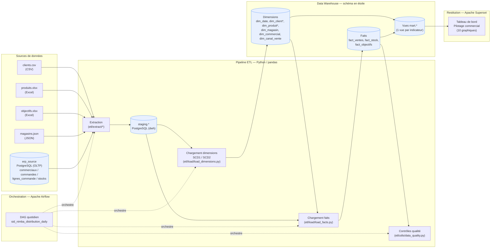
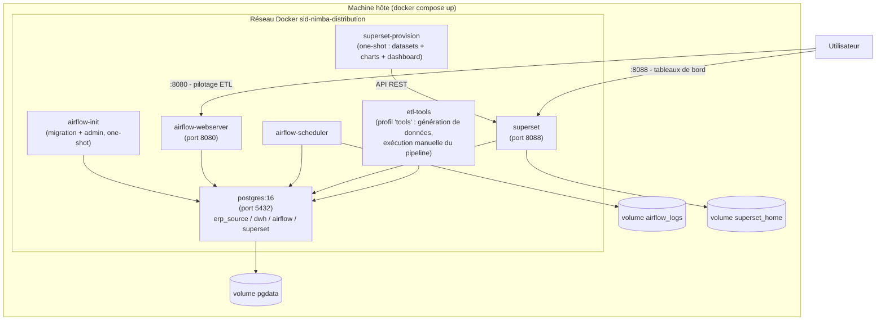

# Schéma d'architecture — SID Nimba Distribution

## Vue détaillée

La vue ci-dessous détaille chaque étape technique du flux (staging, chargement des dimensions/faits, contrôles qualité, vues de restitution) :

*(dim_client et dim_produit sont gérées en SCD Type 2 ; dim_magasin, dim_commercial et dim_canal_vente en SCD Type 1 — voir `docs/MODELE_DIMENSIONNEL.md`.)*

## Déploiement (Docker Compose)

## Composants et rôles

| Composant | Rôle | Technologie |
|---|---|---|
| Sources | Systèmes producteurs de données (fichiers plats, ERP) | CSV, Excel, JSON, PostgreSQL (OLTP) |
| ETL | Extraction, transformation, chargement | Python 3.11, pandas, SQLAlchemy |
| Orchestrateur | Planification, dépendances, reprise sur erreur | Apache Airflow (LocalExecutor) |
| Entrepôt de données | Stockage staging + modèle en étoile + vues de restitution | PostgreSQL 16 |
| Restitution | Tableaux de bord décisionnels | Apache Superset |
| Déploiement | Reproductibilité, isolation, orchestration des services | Docker Compose |
| Versionnement | Traçabilité du code et de la configuration | Git / GitHub |
