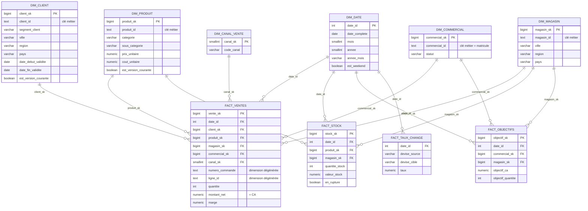

# Modèle dimensionnel — SID Nimba Distribution

Modèle en étoile (approche Kimball), implémenté dans le schéma `dwh` de la base PostgreSQL `dwh` (scripts : `sql/03_dwh/`). Les vues de restitution consommées par Superset vivent dans le schéma `mart` (`sql/04_views/`).

## Schéma en étoile

## Granularité des tables de faits

| Table de faits | Grain (une ligne = ...) | Mesures principales |
|---|---|---|
| `fact_ventes` | Une ligne de commande (un produit, dans une commande, à une date, un magasin, un commercial) | `quantite`, `montant_brut`, `montant_remise`, `montant_net` (= CA), `cout_total`, `marge` |
| `fact_stock` | Un relevé de stock pour un produit, dans un magasin, à une date donnée | `quantite_stock`, `valeur_stock`, `en_rupture` |
| `fact_objectifs` | Un objectif mensuel pour un commercial (rattaché à un magasin) | `objectif_ca`, `objectif_quantite` |
| `fact_taux_change` | Un taux de change pour une paire de devises, à une date | `taux` |

## Stratégie SCD par dimension

| Dimension | Type SCD | Justification |
|---|---|---|
| `dim_date` | Statique (générée) | Dimension calendaire, ne varie jamais |
| `dim_client` | **SCD 2** | Le segment, la ville ou la région d'un client peuvent évoluer ; l'historique a une valeur analytique (ex. : CA généré avant/après un changement de segment) |
| `dim_produit` | **SCD 2** | Le prix ou la catégorie d'un produit évoluent ; une vente doit rester associée au prix/coût en vigueur à sa date |
| `dim_magasin` | SCD 1 | Attributs stables (adresse, géolocalisation) ; l'historisation n'apporte pas de valeur analytique pour ce périmètre |
| `dim_commercial` | SCD 1 | Idem ; seul le statut (actif/inactif) change occasionnellement |
| `dim_canal_vente` | Statique | 3 valeurs fixes (magasin / en ligne / téléphone) |

## Clés de substitution et membres "inconnu"

Chaque dimension expose une clé de substitution technique (`*_sk`, `BIGSERIAL`) distincte de sa clé métier (`*_id`), condition nécessaire à l'implémentation du SCD Type 2 (plusieurs lignes physiques peuvent partager la même clé métier). Chaque dimension possède également un **membre "INCONNU"** (voir `sql/03_dwh/03_seed_membres_inconnus.sql`) : une ligne de fait dont une clé étrangère ne peut être résolue (référentiel incomplet, incohérence source) est rattachée à ce membre plutôt que d'être rejetée, conformément aux bonnes pratiques Kimball — vérifié par le contrôle qualité `part_ventes_client_inconnu_raisonnable`.
